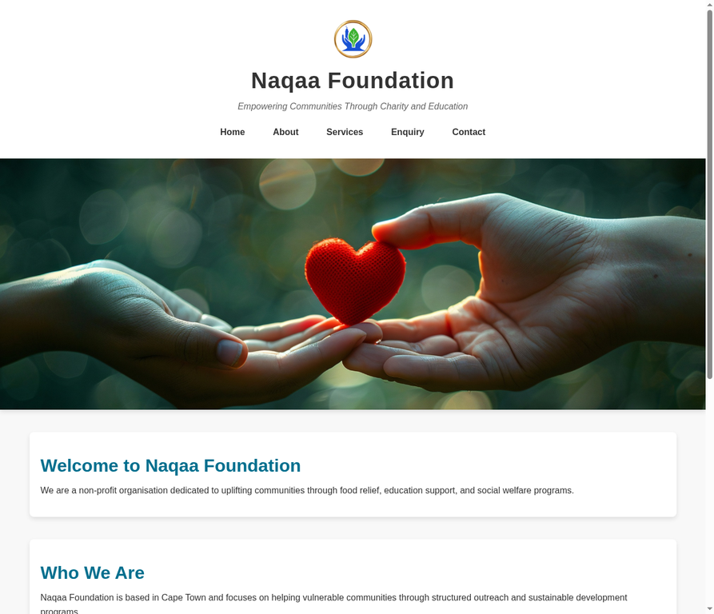
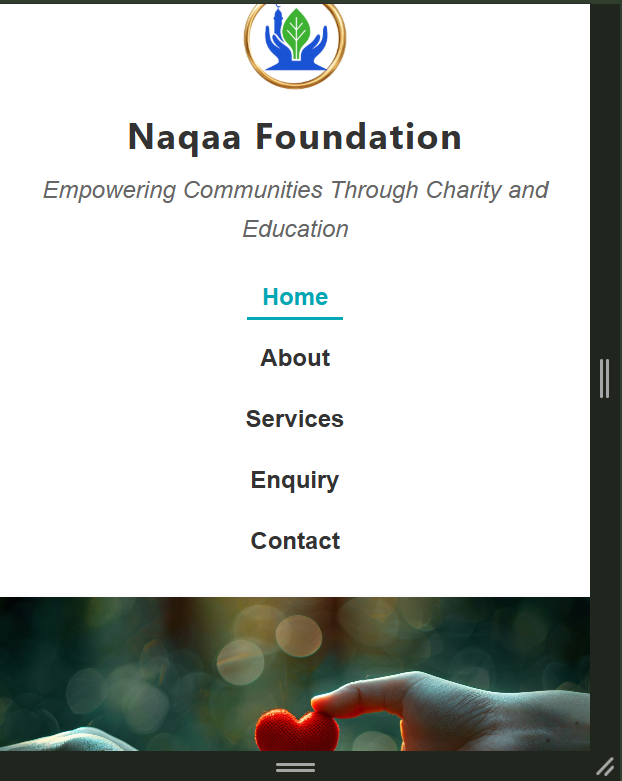

# Naqaa Foundation Website

## Student Information
Name: Abdalla Abdalla  
Student Number: ST10536920  
Module: Web Development (Introduction) – WEDE5020  

---

## Project Overview
This project focuses on the redesign and development of a professional website for
Naqaa Foundation, a non-profit organisation based in Cape Town. The aim is to improve
the overall user experience, accessibility, and functionality of the existing website
while maintaining a clean and structured design.

---

## Website Goals and Objectives
- Increase awareness of Naqaa Foundation and its initiatives  
- Improve website navigation and usability  
- Provide clear and accessible information to users  
- Enable user interaction through enquiry and contact forms  
- Encourage community involvement and support  
- Optimise the website for search engines (SEO)  
- Provide dynamic and interactive features for a better user experience  

---

## Key Features and Functionality
- Homepage with hero overlay, impact stats, service previews, and testimonials  
- About page with mission, vision, YouTube video embed, gallery lightbox, and impact stats  
- Services page with dynamic search/filter feature and interactive FAQ accordion  
- Enquiry page with JS-validated form and dynamic personalised response  
- Contact page with EmailJS-powered email form and Leaflet interactive map  
- Animated donation banner across all pages  
- Fully responsive navigation menu for desktop, tablet, and mobile  
- Structured and semantic HTML5 layout throughout  
- SEO optimised with unique title tags, meta descriptions, keywords, and Open Graph tags  
- robots.txt and sitemap.xml for search engine crawling  

---

## Technologies Used
- HTML5 (structure and semantics)
- CSS3 (styling, animations, and responsive design)
- JavaScript (interactivity, validation, and dynamic content)
- Leaflet.js (interactive map on contact page)
- EmailJS (contact form email functionality)
- Visual Studio Code (development environment)
- GitHub (version control and hosting)  

---

## Project Structure
NAQAA_PROJECT/

│

├── index.html

├── about.html

├── services.html

├── enquiry.html

├── contact.html

├── robots.txt

├── sitemap.xml

├── README.md

│

├── css/

│   └── style.css

│

├── js/

│   └── script.js

│

├── images/

│

└── screenshots/

---

## Sitemap
- Home (index.html)  
- About (about.html)  
- Services (services.html)  
- Enquiry (enquiry.html)  
- Contact (contact.html)  

---

## Setup Instructions
To run this project locally:
1. Clone the repository: `git clone https://github.com/dalawhatumus/NAQAA_PROJECT.git`
2. Navigate to the project folder.
3. Open `index.html` in any modern web browser.
4. For EmailJS contact form functionality, replace the placeholder credentials
   in `js/script.js` with your own EmailJS Public Key, Service ID, and Template ID.

---

## Timeline and Milestones
- Week 1–2: Project planning and research  
- Week 3–4: HTML structure development  
- Week 5–6: CSS styling implementation  
- Week 7–8: Testing, debugging, and improvements  
- Week 9–10: JavaScript interactivity and form validation  
- Week 11–12: SEO optimisation, EmailJS integration, and final testing  

---

## Changelog

### Part 1 Feedback Improvements

- Part 1 feedback identified that wireframes were not submitted (0/2) —
  wireframe sketches for all five pages have been designed and documented
  as part of the Part 2 planning process.

- Part 1 feedback identified that content research and sourcing was
  insufficient (1/10) — comprehensive content has now been researched and
  added across all five pages, including organisational history, program
  descriptions, volunteer information, and contact details sourced from
  Naqaa Foundation materials.

- Part 1 feedback identified that no GitHub commits were made (0/5) —
  the project has now been pushed to GitHub with multiple descriptive commits
  documenting each stage of development.

- Part 1 feedback identified that the README was incomplete (2/5) —
  the README has been fully updated to include project overview, goals,
  structure, sitemap, setup instructions, timeline, changelog, screenshots,
  and references.

- Part 1 feedback identified that no changelog was present (0/5) —
  a detailed changelog has been added to the README documenting all
  Part 1 corrections and Part 2 development work.

- Part 1 feedback noted that code comments were insufficient (4/5) —
  comments have been expanded across all HTML files to fully explain
  each section and element of the code.

---

### Part 2 Development

- Created and linked an external stylesheet (style.css) to all five website
  pages to ensure consistent styling across the entire project.

- Implemented a responsive navigation menu that adapts seamlessly across
  desktop, tablet, and mobile screen sizes.

- Added media queries for tablet (768px) and mobile (480px) breakpoints
  to ensure full responsiveness on all devices.

- Applied a consistent colour scheme using Naqaa Foundation branding
  colours throughout all pages.

- Added comprehensive typography styling including font-family, font-size,
  font-weight, and line-height for headings, paragraphs, navigation, and lists.

- Styled buttons, forms, sections, and navigation elements to create a
  professional and cohesive appearance across all pages.

- Added hover, focus, and active pseudo-class effects to all interactive
  elements to improve user interaction and accessibility.

- Made all images fully responsive using srcset, sizes attributes, and
  max-width: 100% CSS properties.

- Added additional images to the Home and About Us pages to improve
  visual appeal and community engagement.

- Implemented a scrolling donation announcement banner in the header
  using a CSS keyframe animation for modern visual impact.

- Added a Google Maps embed to the Contact page to provide clear
  location information to users.

- Expanded content across all five pages (Home, About, Services, Contact,
  Enquiry) for completeness, depth, and relevance.

- Improved accessibility through semantic HTML5 elements and descriptive
  alt text on all images.

- Enhanced SEO using meta description, keywords, and author meta tags
  on all pages.

- Tested and optimised the website layout and functionality across
  desktop, tablet, and mobile devices.

- Documented all Part 1 corrections and Part 2 additions in this changelog
  for full version control transparency.

---

### Part 2 Feedback Improvements

- Part 2 feedback identified that CSS layout structure lost a mark (4/5) —
  Flexbox and CSS Grid have been explicitly applied to main content areas,
  navigation, form groups, service cards, and stat cards throughout style.css.

- Part 2 feedback identified that CSS decoration and colour lost a mark (4/5) —
  colour usage has been strengthened with CSS variables for success green,
  error red, and border highlights applied consistently across all components.

- Part 2 feedback identified that pseudo-classes lost marks (7/10) —
  additional focus, active, and hover states have been added to navigation
  links, buttons, inputs, gallery images, and accordion buttons throughout
  style.css.

- Part 2 feedback identified that typography adjustments lost a mark (4/5) —
  explicit font-size reductions for h1, h2, h3, and p elements have been
  added to both the 768px and 480px media query breakpoints in style.css.

- Part 2 feedback identified that image adjustments lost a mark (4/5) —
  gallery images, feature images, and hero images now have explicit width,
  height, and object-fit adjustments defined at both breakpoints in style.css.

---

### Part 3 Development

- Implemented a JavaScript accordion component on the services page with
  open/close toggle functionality and +/− visual indicators for each FAQ item.

- Added a gallery lightbox feature on the about page — images open in a
  full-screen overlay when clicked, with close functionality via button,
  outside click, or Escape key press.

- Built a dynamic service search and filter feature on the services page —
  users can type to instantly filter service cards by keyword in real time.

- Integrated a Leaflet.js interactive map on the contact page replacing the
  static Google Maps embed — includes a custom marker and popup with
  Naqaa Foundation location and website link.

- Embedded a YouTube video on the about page using a fully responsive
  16:9 iframe wrapper to showcase Naqaa Foundation's community work.

- Built a fully validated enquiry form on enquiry.html with JavaScript
  client-side validation covering name format, email format, SA phone
  number pattern, enquiry type selection, and message length.

- Implemented conditional form fields on the enquiry form — an availability
  dropdown appears when "Volunteer" is selected, and a contribution amount
  field appears when "Sponsor" or "Donation" is selected, using dynamic
  DOM manipulation.

- Added personalised dynamic responses on the enquiry form — upon valid
  submission, users receive a tailored message based on their selected
  enquiry type (volunteer, sponsor, donation, or general).

- Built a fully validated contact form on contact.html with JavaScript
  client-side validation and EmailJS integration to send form submissions
  as real emails to the organisation.

- Added SEO Open Graph meta tags to all five pages to improve appearance
  when shared on social media platforms such as WhatsApp and Facebook.

- Added unique and optimised title tags, meta descriptions, and keyword
  sets to all five pages for improved search engine visibility.

- Added descriptive alt text and lazy loading attributes to all images
  across the website for improved accessibility and SEO page speed.

- Created robots.txt file to instruct search engine crawlers on which
  pages to index across the website.

- Created sitemap.xml file to help search engines understand the full
  structure and all page URLs of the Naqaa Foundation website.

- Added impact statistics cards to both the home and about pages
  displaying key numbers (200+ families, 500+ meals, 50+ volunteers,
  8+ years) for credibility and content depth.

- Added community testimonial section to the homepage featuring three
  quotes from community members, volunteers, and sponsors.

- Added hero overlay with gradient, headline text, and CTA button on
  the homepage hero image using CSS absolute positioning.

- Implemented smooth scroll behaviour for all anchor links across the
  website using JavaScript event listeners.

- Added automatic active navigation link highlighting based on the
  current page URL using JavaScript, eliminating the need to manually
  set active classes on each page.

- Added a sticky header so the navigation remains visible as users
  scroll down any page, improving usability on all screen sizes.

- Tested and verified all JavaScript features, forms, map, video embed,
  accordion, lightbox, and search functionality across desktop, tablet,
  and mobile screen sizes.

---

## Screenshots Evidence
*(Screenshots are located in the `screenshots/` folder)*

### Desktop View

### Tablet View

### Mobile View

---

## References

Chaffey, D. (2022). *Digital Business and E-Commerce Management*. Pearson.

Duckett, J. (2011). *HTML and CSS: Design and Build Websites*. John Wiley & Sons.

EmailJS (2026). *EmailJS Documentation – Send Emails Directly from JavaScript*.
Available at: https://www.emailjs.com/docs [Accessed: 18 June 2026].

Krug, S. (2014). *Don't Make Me Think: A Common Sense Approach to Web Usability*.
New Riders.

Leaflet.js (2026). *Leaflet – an Open-Source JavaScript Library for Mobile-Friendly
Interactive Maps*. Available at: https://leafletjs.com [Accessed: 18 June 2026].

MDN Web Docs (2026). *CSS Flexible Box Layout*. Available at:
https://developer.mozilla.org/en-US/docs/Web/CSS/CSS_flexible_box_layout
[Accessed: 18 June 2026].

MDN Web Docs (2026). *CSS Media Queries*. Available at:
https://developer.mozilla.org/en-US/docs/Web/CSS/CSS_media_queries
[Accessed: 18 June 2026].

MDN Web Docs (2026). *Client-Side Form Validation*. Available at:
https://developer.mozilla.org/en-US/docs/Learn/Forms/Form_validation
[Accessed: 18 June 2026].

MDN Web Docs (2026). *JavaScript DOM Manipulation*. Available at:
https://developer.mozilla.org/en-US/docs/Web/API/Document_Object_Model
[Accessed: 18 June 2026].

Naqaa Foundation (2026). *Official Website*. Available at:
https://www.naqaafoundation.org [Accessed: 18 June 2026].

OpenStreetMap Foundation (2026). *OpenStreetMap – The Free Wiki World Map*.
Available at: https://www.openstreetmap.org [Accessed: 18 June 2026].
